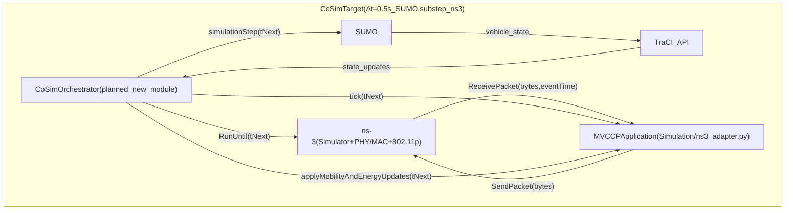
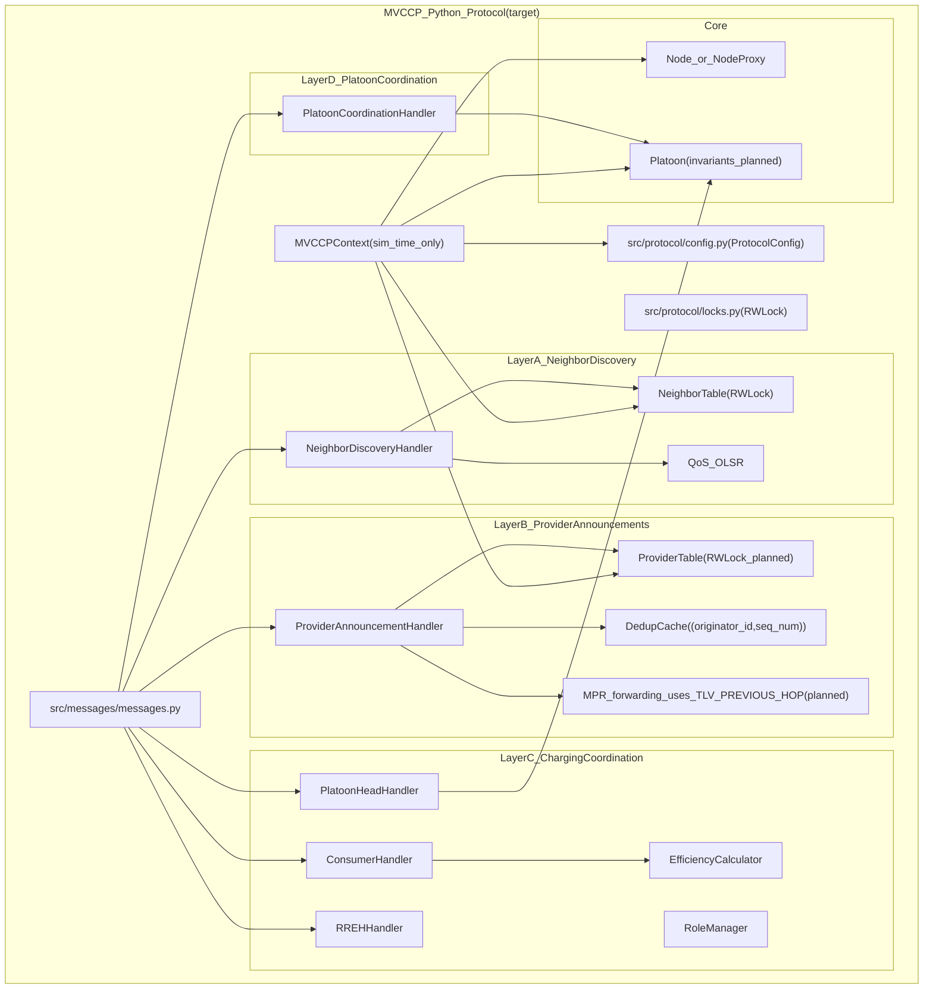
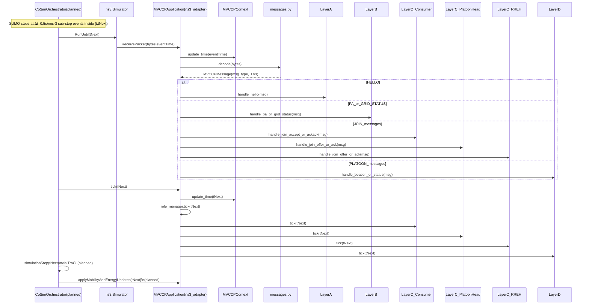
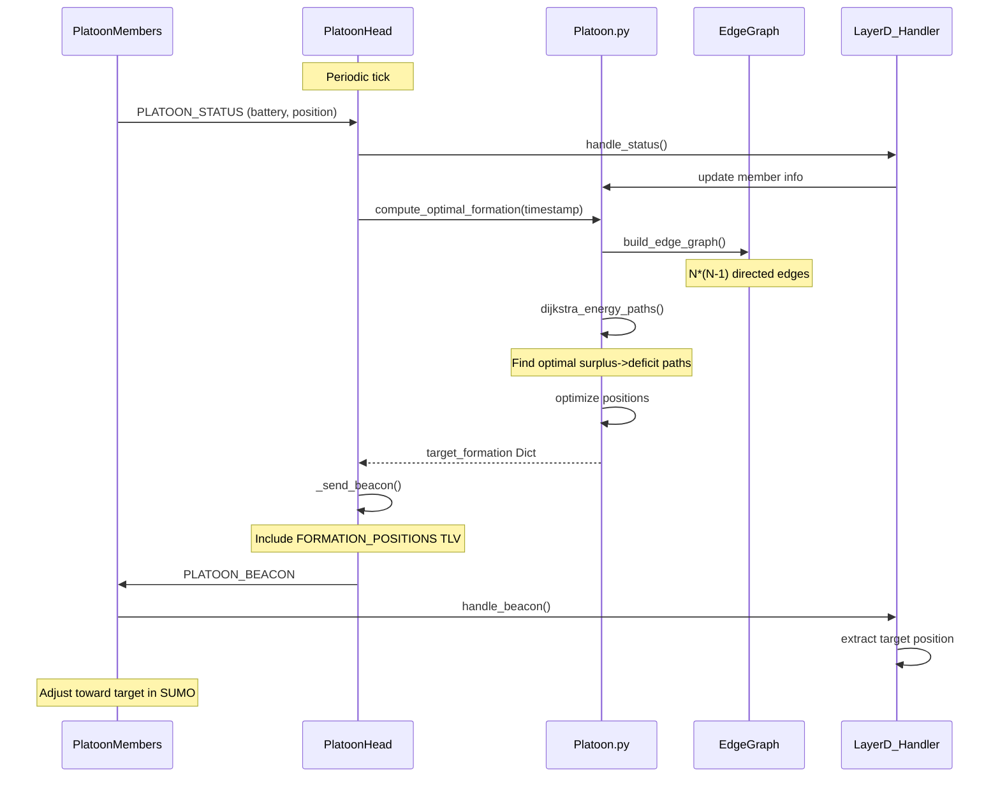
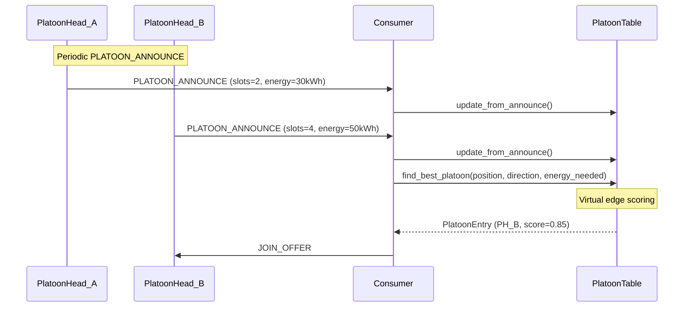
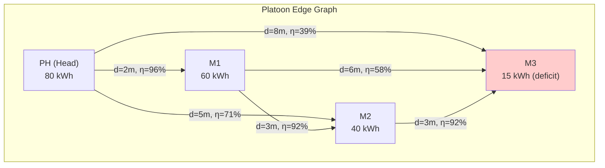

# MVCCP Architecture (Target: SUMO Δt=0.5s + ns-3 PHY/MAC sub-step events)

This document describes the **target architecture** for MVCCP running in a SUMO + ns-3 co-simulation:

- **SUMO** advances at **Δt = 0.5s** per step (controlled by an orchestrator).
- **ns-3** runs **sub-step events** (packets/PHY/MAC) inside each \([t, t+Δt)\) window.
- **Protocol time is simulation-time only**: all protocol logic uses `MVCCPContext.current_time`, advanced only via `context.update_time(timestamp)`.
- **Forwarding identity (Option A)**: `MessageHeader.sender_id` is the **originator ID**; forwarding logic uses a **required** TLV `PREVIOUS_HOP` updated by forwarders.

---

## Co-simulation control plane (target)

---

## MVCCP internal architecture (target)

---

## Event ordering (target)

---

## Edge-Based Platoon Optimization

### Formation Optimization Flow

### Inter-Platoon Discovery Flow

### Intra-Platoon Edge Graph

**Dijkstra finds:** PH → M1 → M2 → M3 path (cumulative η = 81%) is better than PH → M3 direct (η = 39%)
